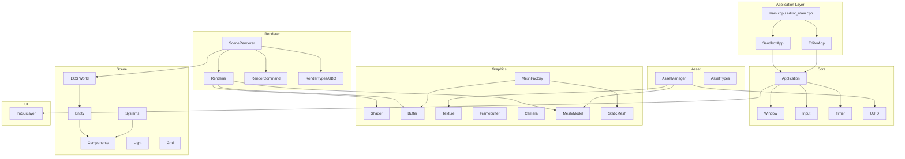
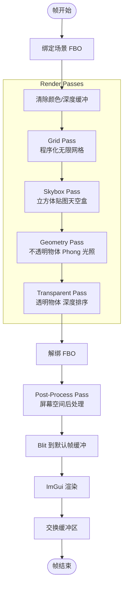
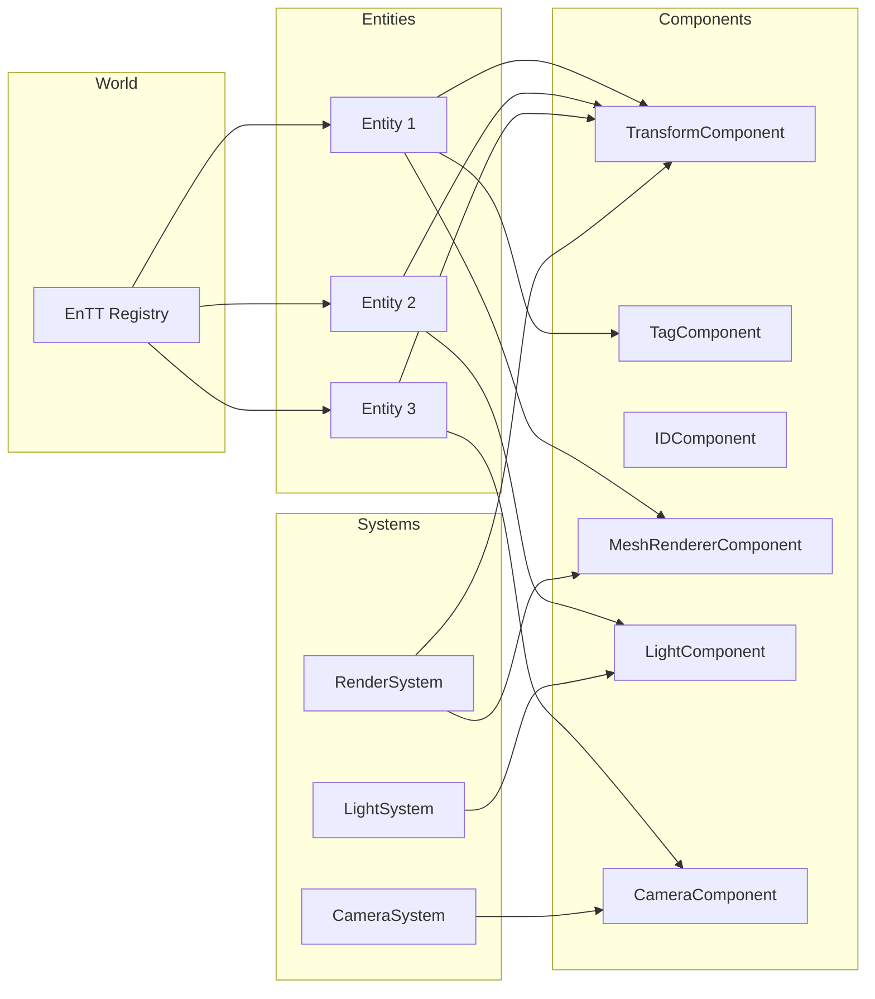

# GLRenderer 架构设计文档

本文档记录 GLRenderer 渲染引擎的架构设计与当前实现状态。

## 1. 概述

GLRenderer 是一个基于 OpenGL 3.3+ 的模块化渲染引擎，从学习项目重构为结构化的引擎架构。

### 技术栈
- **图形API**: OpenGL 3.3 Core Profile
- **语言**: C++20
- **构建系统**: CMake 3.19+
- **窗口管理**: GLFW
- **数学库**: GLM
- **模型加载**: Assimp
- **图像加载**: stb_image
- **UI**: Dear ImGui
- **ECS**: EnTT

---

## 2. 目录结构

```
src/
├── main.cpp                    # SandboxApp 入口点
├── editor_main.cpp             # EditorApp 编辑器入口
│
├── core/                       # 核心系统
│   ├── Application.h/.cpp      # 应用框架与生命周期
│   ├── Window.h/.cpp           # GLFW 窗口封装
│   ├── Input.h/.cpp            # 输入管理（静态类）
│   ├── Timer.h                 # 帧时间管理
│   └── UUID.h                  # 唯一标识符生成
│
├── graphics/                   # GPU 资源（RAII）
│   ├── Shader.h/.cpp           # 着色器与 Uniform 缓存
│   ├── Buffer.h/.cpp           # VAO/VBO/EBO 封装
│   ├── Texture.h/.cpp          # 2D 纹理与 Cubemap
│   ├── Framebuffer.h/.cpp      # FBO 与 MSAA 支持
│   ├── Camera.h/.cpp           # FPS 相机系统
│   ├── Mesh.h/.cpp             # 网格与模型加载
│   ├── StaticMesh.h/.cpp       # 轻量级程序化网格
│   └── MeshFactory.h/.cpp      # 几何体工厂（享元）
│
├── renderer/                   # 渲染管线
│   ├── Renderer.h/.cpp         # 静态渲染器
│   ├── SceneRenderer.h/.cpp    # 场景渲染（多 Pass）
│   ├── RenderCommand.h/.cpp    # 底层 GL 命令封装
│   └── RenderTypes.h           # UBO 结构与管线定义
│
├── scene/                      # 场景管理
│   ├── ecs/                    # ECS 系统（EnTT）
│   │   ├── Components.h        # 组件定义
│   │   ├── Entity.h/.cpp       # 实体封装
│   │   ├── World.h/.cpp        # 世界/注册表管理
│   │   └── Systems.h/.cpp      # 系统处理逻辑
│   ├── Light.h                 # 光源结构
│   └── Grid.h/.cpp             # 无限网格渲染
│
├── asset/                      # 资源管理
│   ├── AssetManager.h/.cpp     # 资源加载与缓存
│   └── AssetTypes.h            # 资源类型与句柄
│
├── editor/                     # 编辑器系统
│   ├── EditorApp.h/.cpp        # 编辑器应用
│   ├── Editor.h/.cpp           # 面板管理
│   └── panels/                 # 各编辑器面板
│       ├── ViewportPanel.h/.cpp
│       ├── HierarchyPanel.h/.cpp
│       ├── InspectorPanel.h/.cpp
│       ├── SettingsPanel.h/.cpp
│       ├── AssetBrowserPanel.h/.cpp
│       ├── ConsolePanel.h/.cpp
│       └── PrimitivesPanel.h/.cpp
│
├── ui/                         # UI 系统
│   └── ImGuiLayer.h/.cpp       # ImGui 生命周期管理
│
└── utils/                      # 工具
    ├── GLCommon.h              # OpenGL 包含与错误检查
    └── DDSLoader.h             # DDS 纹理加载器
```

---

## 3. 模块架构图

### 3.1 整体模块依赖



### 3.2 渲染管线流程



### 3.3 ECS 系统架构



---

## 4. 模块详细设计

### 4.1 Core 模块

#### Application
应用程序基类，提供主循环和生命周期管理。

```cpp
class Application {
public:
    static Application& Get();  // 单例访问
    void Run();                 // 主循环

protected:
    virtual void OnInit() = 0;        // 初始化
    virtual void OnUpdate(float dt) = 0;  // 逻辑更新
    virtual void OnRender() = 0;      // 渲染
    virtual void OnImGuiRender() = 0; // UI 渲染
    virtual void OnShutdown() = 0;    // 清理

private:
    Window m_Window;
    Timer m_Timer;
    bool m_Running = true;
};
```

#### Window
GLFW 窗口封装，支持配置选项。

| 功能 | 说明 |
|------|------|
| VSync 控制 | 垂直同步开关 |
| 窗口大小回调 | 自动处理 resize |
| 光标模式 | Normal / Disabled |
| 帧缓冲大小 | 独立于窗口大小 |

#### Input
静态输入管理类。

```cpp
class Input {
public:
    static bool IsKeyPressed(int keycode);
    static bool IsKeyReleased(int keycode);
    static bool IsMouseButtonPressed(int button);
    static glm::vec2 GetMousePosition();
    static glm::vec2 GetMouseDelta();
    static float GetScrollOffset();
};
```

#### Timer
帧时间与 FPS 管理。

- Delta Time 计算（带安全上限 0.1s）
- 累计时间追踪
- FPS 计算

---

### 4.2 Graphics 模块

#### GPU 资源 RAII 封装

所有 GPU 资源继承 `NonCopyable`，使用移动语义：

| 类 | 封装资源 | 关键特性 |
|----|----------|----------|
| `Shader` | GL Program | Uniform 缓存、UBO 绑定 |
| `VertexBuffer` | VBO | Static/Dynamic 数据 |
| `IndexBuffer` | EBO | 索引计数 |
| `VertexArray` | VAO | 顶点属性管理 |
| `Texture` | 2D Texture | 多格式支持、Mipmap |
| `TextureCube` | Cubemap | 天空盒、环境贴图 |
| `Framebuffer` | FBO | MSAA、实体ID拾取 |

#### Shader 系统

支持两种加载格式：

**统一格式** (推荐):
```glsl
#type vertex
// vertex shader code

#type fragment
// fragment shader code
```

**分离格式** (兼容):
```
shader_vertex.glsl
shader_fragment.glsl
```

Uniform 操作：
```cpp
shader.SetFloat("uTime", time);
shader.SetVec3("uLightPos", lightPos);
shader.SetMat4("uModel", modelMatrix);
shader.SetIntArray("uTextures", texIds, count);
```

#### Camera 系统

FPS 风格相机，支持：
- 欧拉角控制 (Pitch/Yaw)
- 视图/投影矩阵生成
- 可配置移动速度、灵敏度、FOV 范围

```cpp
struct CameraSettings {
    float MovementSpeed = 5.0f;
    float MouseSensitivity = 0.1f;
    float MinZoom = 1.0f;
    float MaxZoom = 90.0f;
};
```

#### Mesh 系统

**MeshVertex 结构**:
```cpp
struct MeshVertex {
    glm::vec3 Position;
    glm::vec3 Normal;
    glm::vec2 TexCoords;
    glm::vec3 Tangent;
    glm::vec3 Bitangent;
    int BoneIDs[MAX_BONE_INFLUENCE];
    float Weights[MAX_BONE_INFLUENCE];
};
```

**Model 加载**: 通过 Assimp 支持 FBX、OBJ、glTF、Collada 格式。

**MeshFactory**: 享元模式提供共享几何体：
- Cube, Sphere, Plane, Cylinder, Quad
- Wireframe 版本
- 自定义尺寸工厂方法

---

### 4.3 Renderer 模块

#### Renderer

静态渲染器，管理场景数据和绘制提交。

```cpp
class Renderer {
public:
    static void BeginFrame(const Camera& camera);
    static void EndFrame();

    static void SubmitMesh(Mesh& mesh, const glm::mat4& transform);
    static void SubmitModel(Model& model, const glm::mat4& transform);

    static void DrawFullscreenQuad();

    struct Stats {
        uint32_t DrawCalls = 0;
        uint32_t Triangles = 0;
        uint32_t Vertices = 0;
    };
};
```

#### SceneRenderer

高层场景渲染器，多 Pass 架构。

```cpp
class SceneRenderer {
public:
    void BeginScene(const Camera& camera);
    void EndScene();

    void SubmitMesh(/* params */);
    void SubmitModel(/* params */);

private:
    void GridPass();
    void SkyboxPass();
    void GeometryPass();
    void TransparentPass();

    std::vector<DrawCommand> m_OpaqueCommands;
    std::vector<DrawCommand> m_TransparentCommands;
};
```

#### RenderCommand

底层 OpenGL 状态封装。

```cpp
class RenderCommand {
public:
    static void SetViewport(int x, int y, int width, int height);
    static void Clear(uint32_t flags);
    static void SetClearColor(const glm::vec4& color);

    static void EnableDepthTest(bool enable);
    static void EnableBlending(bool enable);
    static void SetBlendFunc(GLenum src, GLenum dst);
    static void SetDepthFunc(GLenum func);
    static void EnableFaceCulling(bool enable);
    static void SetCullFace(GLenum face);
    static void SetPolygonMode(GLenum mode);

    static void DrawArrays(GLenum mode, int first, int count);
    static void DrawIndexed(GLenum mode, int count, GLenum type);
};
```

#### UBO 数据结构 (std140)

```cpp
struct CameraUBO {
    glm::mat4 ViewProjection;
    glm::mat4 View;
    glm::mat4 Projection;
    glm::vec4 Position;  // xyz: position, w: padding
};

struct LightingUBO {
    // Directional Light
    glm::vec4 DirLightDirection;
    glm::vec4 DirLightAmbient;
    glm::vec4 DirLightDiffuse;
    glm::vec4 DirLightSpecular;

    // Point Lights (max 4)
    glm::vec4 PointLightPositions[4];
    glm::vec4 PointLightColors[4];
    glm::vec4 PointLightParams[4];  // constant, linear, quadratic, padding

    int PointLightCount;
};
```

---

### 4.4 Scene 模块

#### ECS 系统 (EnTT)

**组件定义**:

| 组件 | 用途 |
|------|------|
| `IDComponent` | UUID 唯一标识 |
| `TagComponent` | 实体名称 |
| `TransformComponent` | 位置、旋转、缩放 |
| `MeshRendererComponent` | 网格渲染数据 |
| `LightComponent` | 光源参数 |
| `CameraComponent` | 相机参数 |

**Entity 封装**:
```cpp
class Entity {
public:
    template<typename T, typename... Args>
    T& AddComponent(Args&&... args);

    template<typename T>
    T& GetComponent();

    template<typename T>
    bool HasComponent();

    template<typename T>
    void RemoveComponent();

private:
    entt::entity m_Handle;
    World* m_World;
};
```

**World 管理**:
```cpp
class World {
public:
    Entity CreateEntity(const std::string& name = "Entity");
    void DestroyEntity(Entity entity);

    template<typename... Components>
    auto View() { return m_Registry.view<Components...>(); }

private:
    entt::registry m_Registry;
};
```

#### 光照系统

```cpp
struct DirectionalLight {
    glm::vec3 Direction;
    glm::vec3 Ambient;
    glm::vec3 Diffuse;
    glm::vec3 Specular;
};

struct PointLight {
    glm::vec3 Position;
    glm::vec3 Ambient;
    glm::vec3 Diffuse;
    glm::vec3 Specular;
    float Constant;
    float Linear;
    float Quadratic;
};

struct SpotLight {
    glm::vec3 Position;
    glm::vec3 Direction;
    float InnerCutoff;
    float OuterCutoff;
    // ... attenuation params
};
```

#### Grid 渲染

程序化无限网格，配置项：
```cpp
struct GridSettings {
    float CellSize = 1.0f;
    float TotalSize = 100.0f;
    glm::vec3 ThinLineColor = {0.3f, 0.3f, 0.3f};
    glm::vec3 ThickLineColor = {0.5f, 0.5f, 0.5f};
};
```

---

### 4.5 Asset 模块

#### AssetManager

单例资源管理器，UUID 句柄系统。

```cpp
class AssetManager {
public:
    static AssetManager& Get();

    // 加载资源
    AssetHandle LoadTexture(const std::string& path);
    AssetHandle LoadModel(const std::string& path);

    // 获取资源
    Texture* GetTexture(AssetHandle handle);
    Model* GetModel(AssetHandle handle);

    // 默认资源
    AssetHandle GetWhiteTexture();
    AssetHandle GetBlackTexture();
    AssetHandle GetCheckerTexture();

    // 统计
    struct Stats {
        uint32_t TextureCount;
        uint32_t ModelCount;
    };

private:
    std::unordered_map<AssetHandle, std::unique_ptr<Texture>> m_Textures;
    std::unordered_map<AssetHandle, std::unique_ptr<Model>> m_Models;
    std::unordered_map<std::string, AssetHandle> m_PathToHandle;  // 去重
};
```

#### AssetHandle

基于 UUID 的资源句柄：
```cpp
using AssetHandle = UUID64;

enum class AssetType {
    None,
    Texture,
    Shader,
    Model,
    Material,
    Cubemap
};

struct AssetMetadata {
    AssetHandle Handle;
    AssetType Type;
    std::string SourcePath;
    bool IsLoaded;
};
```

---

### 4.6 Editor 模块

#### EditorApp

继承 Application，提供编辑器功能：
- ImGui DockSpace 布局
- 场景渲染到 FBO 显示在 Viewport
- 多面板管理
- 实体拾取（通过实体ID缓冲）
- 光源图标可视化

#### 面板系统

| 面板 | 功能 |
|------|------|
| ViewportPanel | 场景渲染、鼠标拾取 |
| HierarchyPanel | 实体树形导航 |
| InspectorPanel | 组件属性编辑 |
| SettingsPanel | 渲染与网格设置 |
| AssetBrowserPanel | 资源浏览与导入 |
| ConsolePanel | 调试输出 |
| PrimitivesPanel | 基础几何体创建 |

---

### 4.7 UI 模块

#### ImGuiLayer

ImGui 生命周期管理：
```cpp
class ImGuiLayer {
public:
    void Init(Window& window);
    void Shutdown();

    void BeginFrame();
    void EndFrame();

    void LoadFont(const std::string& path, float size);
};
```

集成：GLFW + OpenGL 后端，支持 DPI 缩放和多视口。

---

## 5. 设计模式总结

| 模式 | 应用 |
|------|------|
| **RAII** | 所有 GPU 资源（Shader, Buffer, Texture, Framebuffer） |
| **NonCopyable** | 防止 GPU 资源意外拷贝 |
| **单例** | Application, AssetManager, MeshFactory |
| **静态工具类** | Input, RenderCommand, Renderer |
| **享元** | MeshFactory 共享几何体 |
| **ECS** | EnTT 数据驱动场景管理 |
| **命令模式** | DrawCommand 渲染命令队列 |
| **工厂方法** | MeshFactory 创建几何体 |

---

## 6. 着色器资源

```
assets/shaders/
├── 核心着色器
│   ├── lit.glsl              # 标准光照着色器
│   ├── unlit.glsl            # 无光照着色器
│   ├── pbr.glsl              # PBR 物理渲染
│   ├── grid.glsl             # 无限网格
│   ├── skybox.glsl           # 天空盒
│   ├── billboard.glsl        # 公告板
│   └── wireframe.glsl        # 线框渲染
│
├── IBL 处理
│   ├── equirect_to_cubemap.glsl  # 等距矩形转立方体
│   ├── irradiance.glsl           # 漫反射辐照度
│   ├── prefilter.glsl            # 镜面预滤波
│   └── brdf_lut.glsl             # BRDF 查找表
│
├── 后处理
│   ├── framebuffer_frag.glsl     # 后处理片段
│   └── depth_debug_fragment.glsl # 深度可视化
│
└── 旧版/测试
    ├── light_*.glsl
    ├── model_*.glsl
    ├── lamp_*.glsl
    └── test_*.glsl
```

---

## 7. 向后兼容

项目保持新旧代码兼容：

| 特性 | 旧版 | 新版 |
|------|------|------|
| Camera 成员 | 公开成员 | 私有 + getter/setter |
| 枚举命名 | `Camera_Movement` | `CameraMovement` |
| 着色器加载 | 分离文件 | 统一格式 |
| 命名空间 | 全局 | `GLRenderer::` + 全局别名 |

---

*最后更新: 2026-03-19*
