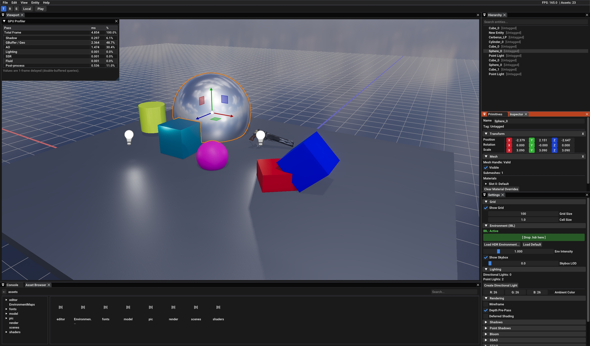
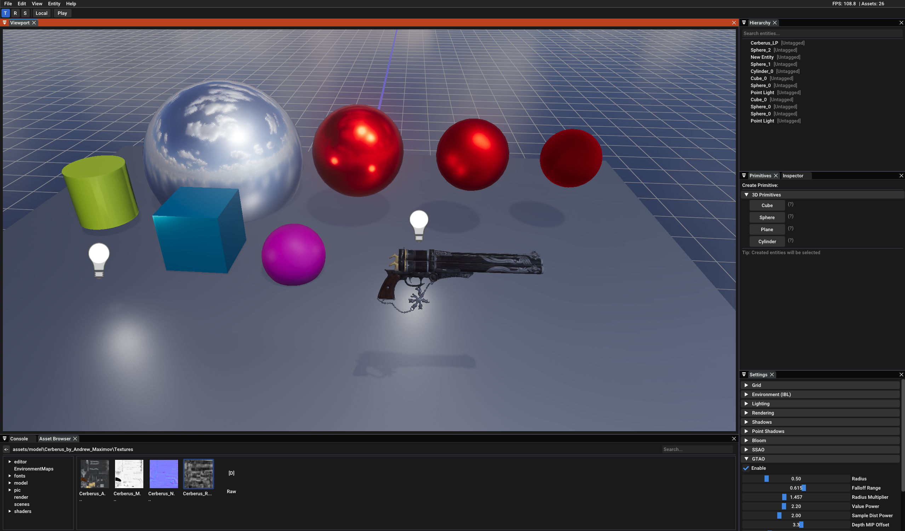
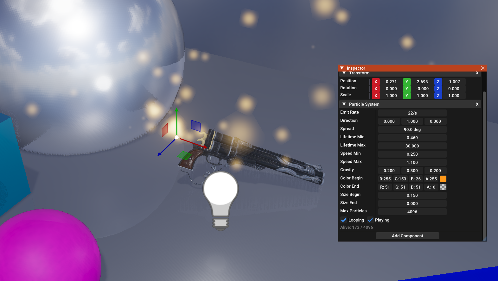
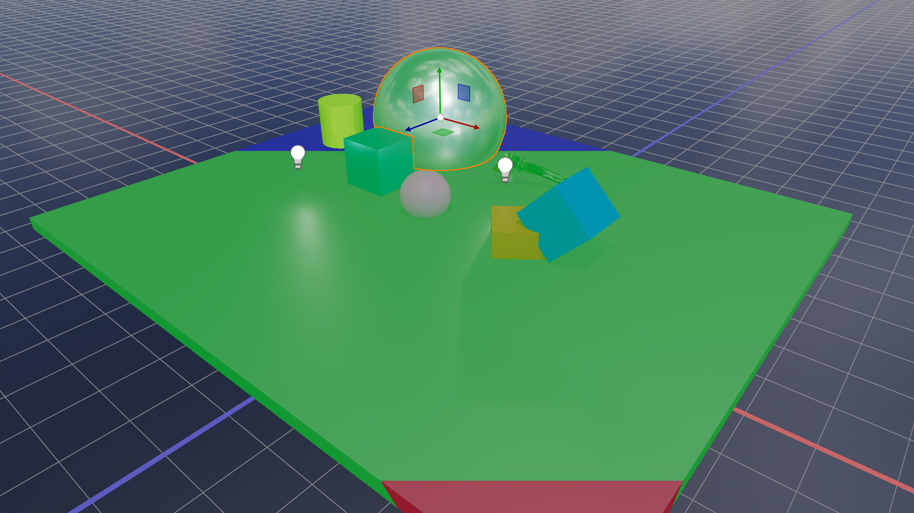
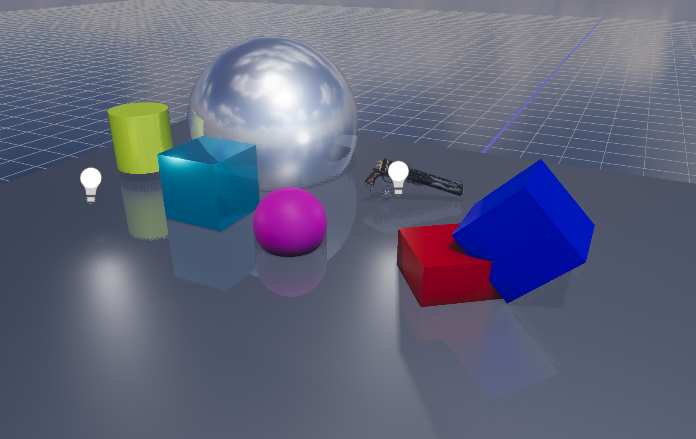
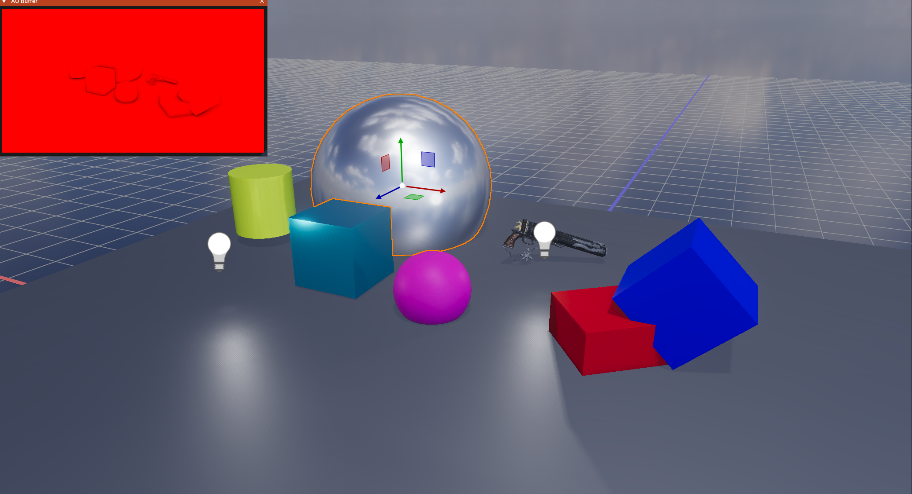
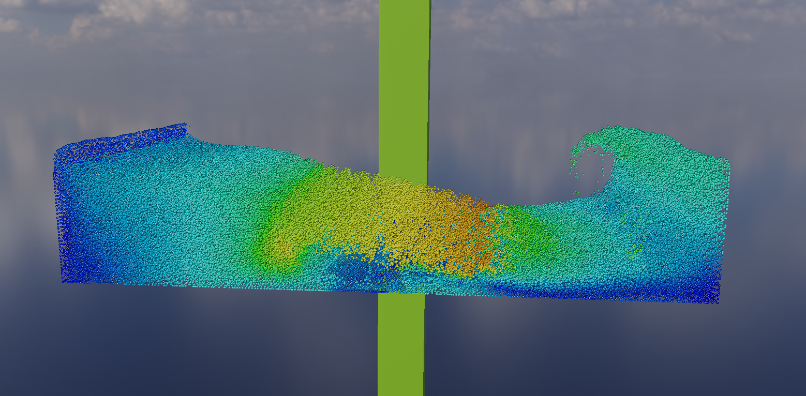
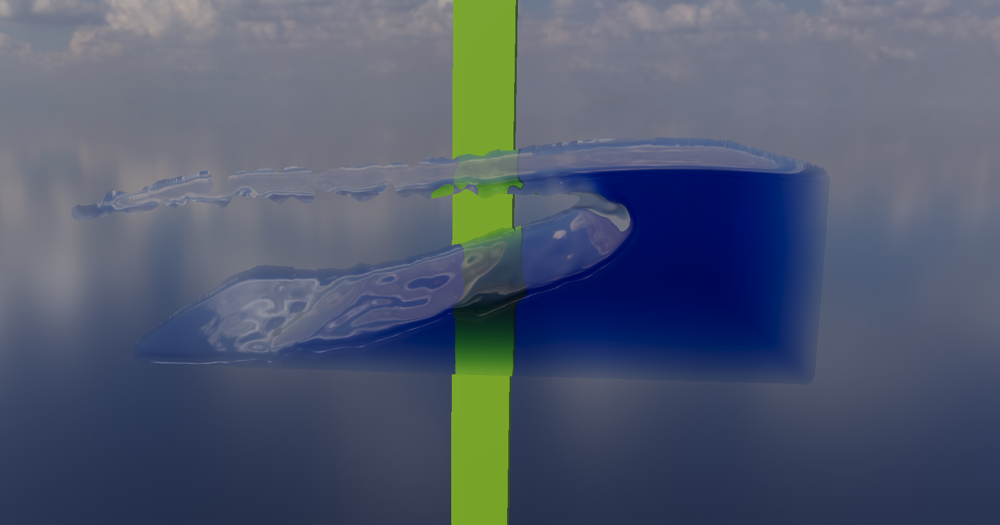

# GLRenderer

- 基于 OpenGL 4.3+ 构建的实时渲染引擎，实现了物理渲染管线、GPU 加速流体仿真与 ImGui 编辑器。
- 演示视频链接: https://www.bilibili.com/video/BV1DPXhBvEkY


---

## 效果展示


| 基础的编辑器与场景系统| PBR + IBL |
|:---------:|:------------------------:|
|  |  |

|  Compute Shader驱动的粒子系统 | 级联阴影贴图 (CSM + PCSS) |
|:---------:|:------------------------:|
|  |  |

| 屏幕空间反射 (SSR) | SSAO |
|:-----------------:|:-----------:|
|  |  |

| GPU 流体仿真 (PBF) | 屏幕空间流体渲染 (SSFR) |
|:-----------------:|:----------------------:|
|  |  |

| 粒子发射器 | G-Buffer 碰撞 |
|:---------:|:------:|
|  |  |

---

## 功能

### 渲染管线

- **双渲染路径** - Tiled Forward+(旧实现) 与 Tiled Deferred(主要实现) 可切换
- **深度预处理 (Depth Pre-Pass)** - 在 PBR Pass 前写入深度, 消除 overdraw

### PBR 与光照

- **物理渲染 (PBR)** - 金属度/粗糙度工作流，GGX BRDF
- **基于图像的照明 (IBL)** - HDR 环境卷积, 辐照度贴图, 预过滤高光, BRDF LUT
- **级联阴影贴图 (CSM)** - 最多 4 级, Poisson PCF / PCSS 软阴影, 级联过渡平滑
- **点光源阴影** - 全向立方体贴图阴影数组, Tiled 光源剔除
- **屏幕空间反射 (SSR)** - 目前选用DDA + 二分, 可选半分辨率, 边缘淡出

### 环境光遮蔽

- **SSAO** - 半球采样 + 双边模糊
- **GTAO** - Ground Truth AO + Hilbert 曲线去噪；两者共用同一 AO 绑定点无缝切换, 后续作为主要AO

### 后处理

- **Bloom** - 预过滤 -> 8 级DownSampling金字塔 -> 平滑上采样叠加
- **色调映射** - 曝光控制, HDR -> LDR

### Compute Shader的粒子系统
- **三段Compute Pass** - Emit, Update, Compact.
- **存储结构**: GPUParticle, Alive List, Dead List, Counter SSBO
- **Indirect Draw**, 避免回读CPU
- **PCG伪随机, 锥形方向发射**

### GPU 流体仿真（基于位置的流体 PBF）

全程 Compute Shader 驱动的 XPBD/PBF 求解器：

| 阶段 | 说明 |
|------|------|
| 空间哈希 | 7 次 dispatch 并行前缀和, 27 格邻域搜索 |
| 约束求解 | 密度 λ 修正, 每子步 3–4 次迭代 |
| 速度更新 | XSPH 粘度, 涡度恢复 |
| 场景碰撞 | 读取 G-Buffer 深度/法线, 单帧延迟碰撞响应 |
| 粒子发射器 | 锥形扩散发射, 生命周期追踪, free list回收 |

### 屏幕空间流体渲染（SSFR）

1. PointSprite, 粒子球形深度光栅化
2. Narrow-Range Filter（σ_d = 8px，半径 15px）
3. 表面法线重建（Min-Diff 自适应叉积法）
4. 厚度累积 + 高斯扩散
5. 着色 - Fresnel 反射, Beer–Lambert 吸收, 折射 UV 偏移

### 流体粒子发射器组件

1. 所有粒子共享

### 编辑器

- **DockSpace 布局** - 视口、检视器、层级、设置、GPU 分析器面板
- **ECS 场景** - EnTT 注册表，组件序列化为 `.glscene`（JSON）
- **Play 模式** - 进入 Play 时 JSON 快照场景，Stop 后精确还原编辑器状态
- **BVH 视锥剔除** - Binned SAH 构建，迭代 DFS 查询，实时剔除统计
- **GPU Profiler** - 每 Pass 双缓冲 `GL_TIME_ELAPSED` 查询，编辑器内实时显示
- **Gizmo 变换**, 实体轮廓选中, 光源图标 Billboard

---

## 架构

```
src/
├── core/          应用生命周期, 窗口, 输入, 计时
├── graphics/      RAII GPU 资源 - Buffer, Shader, Texture, Framebuffer
├── renderer/      SceneRenderer（20+ Pass）, IBL 烘焙, 材质系统
├── scene/         ECS（EnTT）, BVH, 视锥体, Grid, Light, 场景序列化
├── physics/       FluidSimulation, EmitterFluidSimulation, PhysicsWorld
├── editor/        EditorApp, 面板, 编辑器上下文, Play 模式
└── asset/         AssetManager, 基于 Handle 的资产序列化
```

- `Ref<T>`（`shared_ptr`）用于共享资源，`Scope<T>`（`unique_ptr`）用于独占所有权
- Forward+ Tiled 光源列表在 CPU 构建后通过 SSBO 上传
- 流体仿真状态完全驻留 GPU, CPU 仅设置 uniform

---

## 构建

```bash
cmake -B build -DCMAKE_BUILD_TYPE=Release
cmake --build build --config Release
# 输出：bin/GLRendererEditor.exe
```

**环境要求：** CMake 3.19+, C++20, OpenGL 4.3+ 驱动.

---

## 依赖

| 库 | 用途 |
|----|------|
| GLFW 3 | 窗口与输入 |
| GLAD | OpenGL 加载器 |
| GLM | 数学库 |
| ImGui | 编辑器 UI |
| EnTT | ECS |
| Assimp | 模型加载 |
| stb_image | 纹理加载 |
| nlohmann/json | 场景序列化 |
